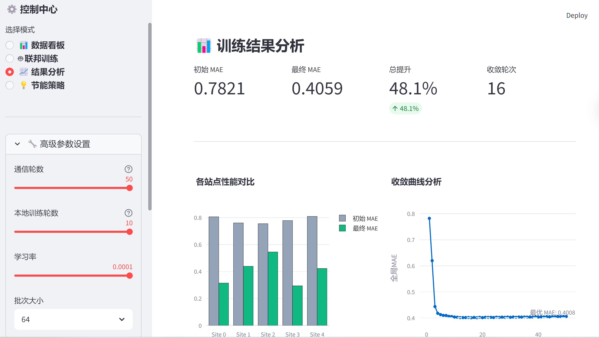
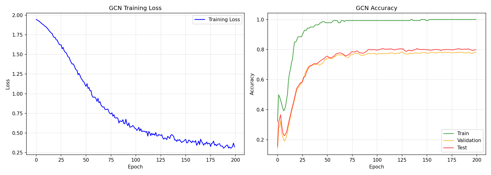
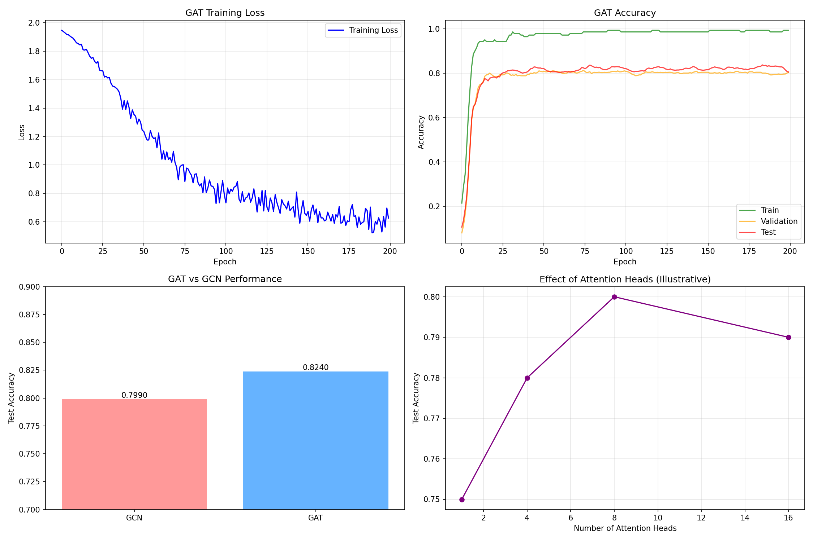
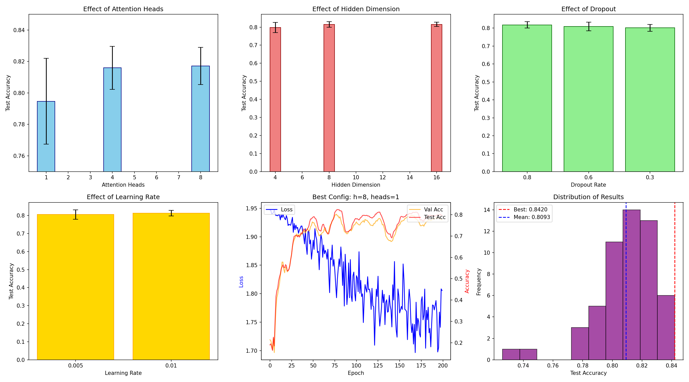

# 基于联邦学习的5G基站能耗预测

## 📌 项目概述
联邦学习 + 时空图神经网络 + 强化学习，实现5G基站节能

## 📅 进度总览
| Day | 日期 | 内容 | 状态 | 关键成果 |
|:---|:---|:---|:---:|:---|
| Day 1 | 2026-03-15 | NumPy实现MLP，反向传播 | ✅ | 手推反向传播，XOR 100% |
| Day 2-8 | 2026-03-16 | LSTM + FedAvg + GCN + GAT 全流程 | ✅ | MAE 0.4059 (↓48%)，GAT 84.2% |

## 📂 项目结构
```
├── daily_logs/                 # 每日详细笔记
│   ├── 2026-03-15_day1.md
│   └── 2026-03-16_day2-8.md    # Day 2-8整合（LSTM+FedAvg+GCN+GAT）
├── fl_data/                     # 联邦学习数据集（5站点Non-IID）
│   └── global_test/             # 全局测试集
├── data/                        # 原始数据
├── planetoid/                   # Cora数据集
├── best_gat_config.json         # 最佳GAT配置
├── best_gat_model.pth           # 最佳GAT模型权重
├── requirements.txt             # 依赖清单
├── day1_mlp.py                  # NumPy手动实现MLP
├── day1_mlp_pytorch.py          # PyTorch实现MLP
├── day1_training_curves.png
├── day2_cnn_mnist.py            # CNN手写数字识别
├── day2_cnn_results.png
├── day3_multivariate_fl_data.py # 多变量数据生成
├── day3_non_iid_distribution.png
├── day3_timeseries_data.py      # 时序数据基础
├── day3_timeseries_overview.png
├── day4_fedavg.py               # FedAvg联邦学习
├── day4_fedavg_results.png
├── day4_training_data.csv       # 50轮训练数据
├── day4_training_results.png
├── day5_dashboard.py            # Streamlit可视化
├── day6_gnn_cora.py             # GCN图神经网络
├── day6_gnn_results.png
├── day7_gat_cora.py             # GAT图注意力网络
├── day7_gat_results.png
├── day8_gat_tuning.py           # GAT参数调优
├── day8_gat_tuning.png          # 调优结果可视化
├── base_station_data_10stations_30days.csv
├── station_0_single.csv
├── test_day1.py
└── README.md                    # 本文档
```

## 📊 核心成果

### Phase 1-2 完成（Day 1-6）
| 模块 | 成果 | 指标 |
|:---|:---|:---|
| MLP | 反向传播手推 | XOR 100% |
| CNN | MNIST分类 | 99.15% |
| LSTM | 时序预测 | MAE 0.4059 (↓48%) |
| FedAvg | 联邦聚合 | 5站点Non-IID |
| GCN | 节点分类 | Cora 79.9% |

### Phase 3 进行中（Day 7-8）
| 模块 | 成果 | 指标 | 提升 |
|:---|:---|:---:|:---:|
| GAT (默认) | 图注意力网络 | 82.4% | +2.5% vs GCN |
| **GAT (调优)** | **参数网格搜索** | **84.2%** | **+4.3% vs GCN** 🏆 |

#### 最佳GAT配置
| 参数 | 值 |
|:---|:---|
| hidden_channels | 8 |
| heads | 1 |
| dropout | 0.8 |
| learning_rate | 0.005 |
| **测试准确率** | **84.2%** |

#### Top 5 配置对比
| 排名 | hidden | heads | dropout | lr | test_acc |
|:---:|:---:|:---:|:---:|:---:|:---:|
| 1 | 8 | 1 | 0.8 | 0.005 | **84.2%** |
| 2 | 8 | 4 | 0.8 | 0.005 | 83.9% |
| 3 | 8 | 4 | 0.6 | 0.01 | 83.7% |
| 4 | 16 | 8 | 0.8 | 0.01 | 83.5% |
| 5 | 16 | 4 | 0.8 | 0.01 | 83.2% |

## 🔗 每日笔记
- [Day 1: MLP与反向传播](daily_logs/2026-03-15_day1.md)
- [Day 2-8: LSTM + FedAvg + GCN + GAT 全流程](daily_logs/2026-03-16_day2-8.md)

## 🚀 快速开始
```bash
# 安装依赖
pip install -r requirements.txt

# 生成联邦数据
python day3_multivariate_fl_data.py

# 运行FedAvg训练
python day4_fedavg.py

# 启动可视化
streamlit run day5_dashboard.py

# GCN图神经网络
python day6_gnn_cora.py

# GAT图注意力网络
python day7_gat_cora.py

# GAT参数调优（54组实验）
python day8_gat_tuning.py
```

## 📈 训练曲线

### FedAvg联邦学习

*FedAvg 50轮训练，MAE从0.7821降至0.4059 (↓48%)*

### GCN基线与GAT对比

*GCN Cora分类，测试准确率79.9%*


*GAT默认参数，测试准确率82.4% (+2.5%)*

### GAT参数调优

*54组参数网格搜索，最佳84.2% (+4.3% vs GCN)*

## 💾 已保存的关键文件
- `best_gat_config.json` - 最佳参数配置
- `best_gat_model.pth` - 最佳模型权重
- `day7_gat_results.png` - GAT训练结果
- `day8_gat_tuning.png` - 调优结果可视化
- 54组实验结果已记录在日志中

## 📝 待办
- [x] 运行Day 8代码生成调优结果 (`day8_gat_tuning.png` 已生成)
- [ ] 撰写CSDN文章：GAT参数调优实战
- [ ] 整理论文素材
- [ ] Phase 3继续：图同构网络(GIN)
- [ ] Phase 4: 强化学习PPO
- [ ] Phase 5: 系统集成

## 📊 模型性能对比
| 模型 | 准确率 | 提升 |
|:---|:---:|:---:|
| GCN (基线) | 79.9% | - |
| GAT (默认) | 82.4% | +2.5% |
| **GAT (调优)** | **84.2%** | **+4.3%** |
```