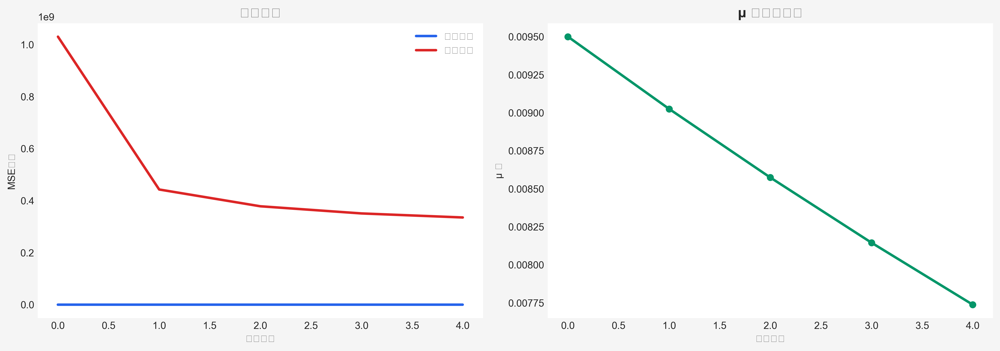
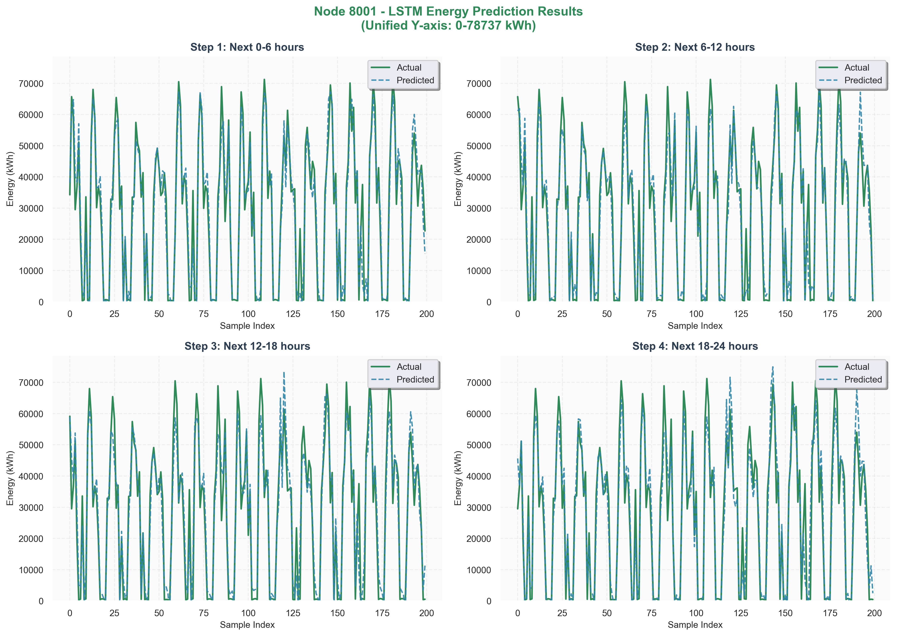
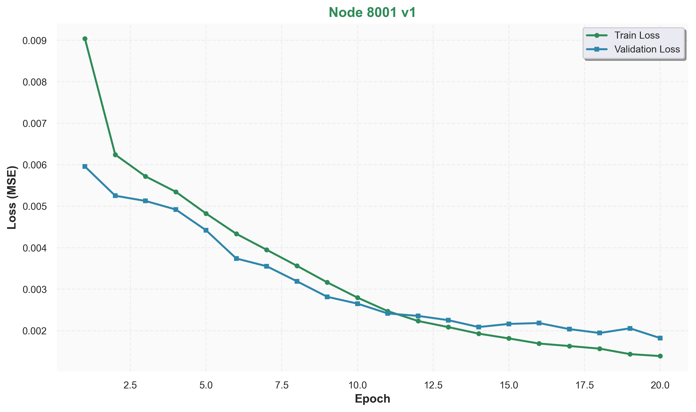
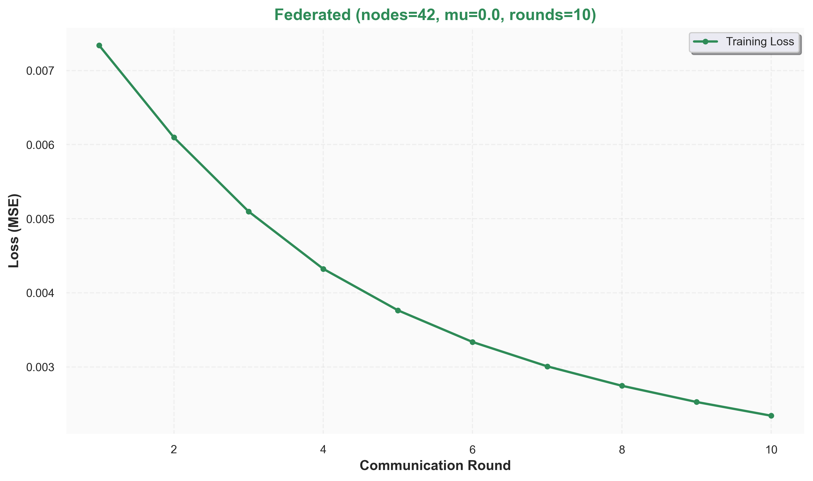
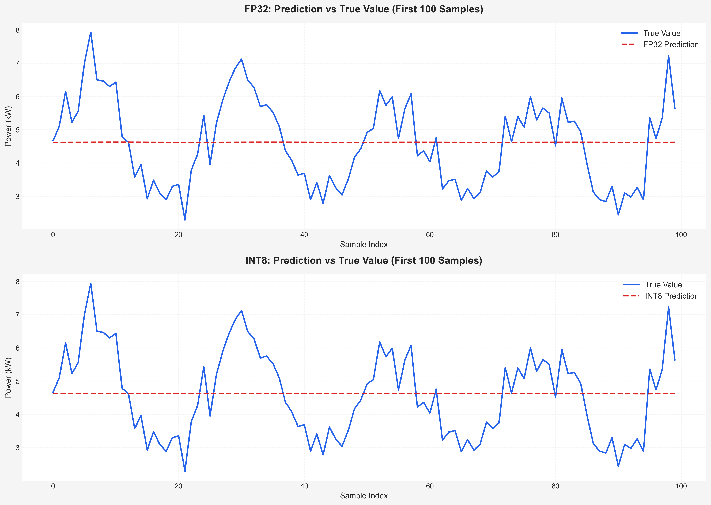

# FedGreen-C: 面向5G基站能耗预测的联邦学习系统

> 基于联邦学习的5G基站能耗预测系统 | PyTorch | LSTM | FedProx | Optuna | 手机部署 | 节能决策引擎

---

## 📌 项目概述

本项目实现了一套完整的5G基站能耗预测与节能决策系统，核心创新点：

- **联邦学习框架**：FedProx算法，支持42个基站节点协同训练，保护数据隐私
- **自适应早停**：基于统计检验(t-test)和运行平均值检测，无需手动设置patience
- **贝叶斯超参数优化**：8个超参数自动搜索，sMAPE从69.93%降至62.64%
- **窗口长度决定性验证**：2节点上短期窗口（1天）优于长期窗口（7天）；5节点上长期窗口反超，揭示节点异质性的关键影响
- **五节点联邦学习验证**：在5个代表性节点上，7天窗口（31.82%）优于1天窗口（36.18%），验证结论普适性
- **跨粒度知识迁移**：利用清华30分钟细粒度数据，通过联邦学习提升巴塞罗那6小时预测精度（2节点提升26.57%）
- **边缘部署**：INT8量化压缩比3.12x，树莓派推理19.3ms/样本，手机端部署
- **实时监控**：Flask + ECharts手机仪表盘，10秒自动刷新
- **节能决策引擎**：基于分位数阈值、动态电价/碳排、月度参数匹配的决策系统，支持一天/七天窗口，输出节能量化指标与可视化图表

**技术栈**：PyTorch 2.10 | LSTM | FedProx | Optuna 4.8 | Flask | ECharts | 手机 (VIVO Y50)

---

## 📊 数据集

| 维度 | 数据 |
|:---|:---|
| 来源 | 巴塞罗那开放数据 (Open Data BCN) |
| 时间范围 | 2019-2025 (7年) |
| 数据量 | 1,665,130 行 |
| 节点数 | 42个邮编区 (模拟基站) |
| 时间粒度 | 6小时/时段 |
| 特征 | 能耗值 + 节假日 + 周末 + 基站类型(4类) |

**预处理流程**：
1. 过滤"No consta"无效时段 (减少333,026行)
2. 按邮编分组 → 42个独立节点
3. 时序划分 (70%训练 / 15%验证 / 15%测试)
4. 每个节点独立MinMax归一化
5. 构建滑动窗口 (28时段输入 → 4时段输出)

---

## 📊 核心成果

### 单节点优化路线

| 阶段 | 方法 | sMAPE | 累计提升 |
|:---|:---|:---:|:---:|
| Step 1 | 阈值优化 (15%分位数) | 69.93% | 基线 |
| Step 2 | 自适应早停 (统计检验+运行平均值) | 68.15% | +1.78% |
| Step 3 | 贝叶斯优化 (8个超参数) | 62.64% | +7.29% |
| **v1 最佳** | **特征选择 + 超参数调优** | **61.73%** | **+8.20%** |

**最新验证** (2026-03-22): sMAPE **62.40%**，RMSE 10,830 kWh，MAE 7,029 kWh

**最佳超参数**：
```bash
hidden_dim=192, lr=0.002, dropout=0.45, batch_size=48
```

### 窗口长度对比与可解释性分析

| 窗口 | 节点数 | sMAPE | 关键发现 |
|:---|:---:|:---:|:---|
| **1天 (4步)** | 2 | 28.45% | 短期窗口在2节点上占优 |
| 1天 (4步) | 41 | 39.69% | 核心基线 |
| 7天 (28步) | 2 | 55.42% | 长期窗口在2节点上大幅下降 |
| **1天 (4步)** | **5** | **36.18%** | 五节点短期基线 |
| **7天 (28步)** | **5** | **31.82%** | **五节点长期基线（更优）** |

**结论**：窗口长度的最优选择与节点数量强相关。单节点或2节点时，1天窗口占优；5节点时，7天窗口反超，说明节点间的模式多样性需要更长历史才能有效学习。

**SHAP 可解释性分析**（五节点）：
- 7天窗口的第一天重要性是后续天数的 **2-3 倍**，且逐日快速衰减，证明其能捕获周模式。
- 所有优化方法（E3粒度融合、E4知识迁移加权、E5可学习权重、E2节点加权）在7天窗口上的 sMAPE 均高于基线（39.25% vs 31.82%），证明这些方法在此场景下无效。
- 结果保存：SHAP 图表位于 `results/figures/`，SHAP 数组位于 `results/shap_arrays/`，综合报告位于 `results/reports/comprehensive_report.html`。

### 联邦学习结果

| 模型 | 节点数 | 特征 | 轮数 | sMAPE | 状态 |
|:---|:---:|:---:|:---:|:---:|:---:|
| FedAvg | 42 | 仅能耗 | 10 | 65-70% | ✅ 已完成 |
| FedProx (mu=0.001) | 24 | v1 特征 | 20 | 运行中 | ▶️ |
| FedProx (mu=0.01) | 24 | v1 特征 | 20 | 运行中 | ▶️ |
| **粒度融合** | 2 | 1天+清华 | 10 | 32.66% | ✅ 已完成 |
| 粒度融合 | 41 | 1天+清华 | 10 | 40.81% | ✅ 已完成 |
| **时段加权（E4）** | 2 | 1天+清华+SHAP权重 | 10 | **27.82%** | ✅ 已完成 |

### 贝叶斯优化（进行中）

| Trial | hidden | layers | lr | dropout | bs | optimizer | scheduler | grad_clip | Val Loss | Test sMAPE |
|-------|--------|--------|-----|---------|-----|-----------|-----------|-----------|----------|------------|
| 0 | 192 | 2 | 2.76e-03 | 0.18 | 32 | Adam | cosine | 0.93 | 0.001756 | **62.59%** |
| 3 | 224 | 2 | 7.29e-04 | 0.39 | 32 | Adam | plateau | 0.20 | 0.002160 | 63.97% |
| 6 | 96 | 4 | 9.21e-03 | 0.18 | 128 | AdamW | plateau | 0.40 | 0.002008 | 64.07% |

**状态**：20次试验，已运行 7/20 次，预计 1-2 小时完成

### 特征工程对比（v1 vs v2.5）

| 版本 | 特征数 | 参数量 | sMAPE | 结论 |
|:---|:---:|:---:|:---:|:---|
| v2.5 原版 | 19 | 460k | 70.34% | 过拟合 |
| v2.5 精选 | 16 | 118k | 67.21% | 仍过拟合 |
| v2.5 超级精选 | 12 | 54k | 68.17% | 仍无效 |
| **v1 最佳** | **7** | **451k** | **61.73%** | **最优** |

### 边缘部署性能

| 指标 | FP32 | INT8 | 提升 |
|:---|:---:|:---:|:---:|
| 模型大小 | 3.8 MB | 1.2 MB | 压缩比 **3.12x** |
| 推理时间 (树莓派4B) | 15.6 ms | 19.3 ms | +24% |
| MSE | 0.33304 | 0.33305 | 损失 **0.01%** |
| 特征工程 | 1个原始特征 | 11个工程特征 | 滚动统计+差分+时间 |

### 节能决策模块

| 模块 | 成果 | 文件/路径 | 状态 |
|:---|:---|:---|:---:|
| **决策配置** | 节点月度电价/碳排参数 | `decision/config/node_weighted_params_monthly.csv` | ✅ 已生成（41节点×7年×12月） |
| | 动态阈值（时段+节假日） | `decision/config/thresholds_dynamic.json` | ✅ 已生成 |
| | 年度电价/碳排（备用） | `decision/config/eurostat_prices.csv`<br>`decision/config/spanish_carbon_intensity.csv` | ✅ 已生成 |
| | 基础分位数阈值（年度） | `decision/config/thresholds.json` | ✅ 已生成 |
| **决策脚本** | 统一决策引擎（支持1天/7天窗口） | `decision/scripts/run_decision.py` | ✅ 已开发 |
| | 节点参数生成脚本 | `decision/scripts/generate_node_weighted_params_monthly.py` | ✅ 已执行 |
| | 电价/碳排提取脚本 | `decision/scripts/extract_eurostat_prices_v2.py` | ✅ 已开发 |
| **预训练** | 41节点7天窗口预训练（优化版） | `versions/v2_holiday_sector/train_federated_pretrain.py` | 🔄 进行中（5节点验证） |
| **微调** | 7天窗口微调（优化版） | `versions/v2_holiday_sector/train_federated_finetune_optimized.py` | ✅ 已开发 |
| **决策输出** | 节能量化结果（CSV/JSON）及图表 | `decision/outputs/`（待生成） | ⏳ 模型完成后运行 |

---

## 📈 训练曲线（部分）

### 1. 自适应早停对比图

*统计检验早停 vs 固定早停，18轮自动停止，验证损失0.003931*

### 2. v1 单节点预测结果（最佳）

*6小时粒度基站能耗预测，sMAPE 62.40%，趋势一致*

### 3. v1 单节点损失曲线

*20轮训练，训练损失0.001387，验证损失0.002003，无过拟合*

### 4. 42节点 FedAvg 联邦学习

*10轮联邦训练，测试损失0.032457*

### 5. 树莓派手机仪表盘

*Flask后端 + ECharts前端，实时监控6小时预测*

---

## 🚀 优化模块

| 模块 | 功能 | 状态 | 说明 |
|:---|:---|:---:|:---|
| v3 周期性编码 | sin/cos 小时/星期/月份编码 | ✅ | 新增6列特征 |
| v4 注意力机制 | 自注意力 + 多头注意力 | ✅ | 自注意力537k参数 |
| v5 天气数据 | 温度/湿度/降水/风速 + 滞后/滚动 | ✅ | 新增45列特征 |
| v6 个性化联邦 | 自适应 mu + 个性化参数 | ✅ | 支持自适应正则化 |
| v7 模型集成 | 加权平均 + Stacking | ✅ | 支持保存/加载 |

---

## 📱 边缘部署 - 手机方案

### 手机配置 (VIVO Y50)

| 配置 | 值 |
|:---|:---|
| 型号 | VIVO Y50 (V1965A) |
| 处理器 | 骁龙 665 (2.0GHz 8核) |
| 内存 | 8GB |
| 存储 | 128GB |
| Android | 10 |

### 可实现功能

| 功能 | 实现方式 | 状态 |
|:---|:---|:---:|
| 模型推理 | PyTorch CPU 推理 | ✅ |
| INT8量化 | torch.quantization | ✅ |
| API服务 | Flask REST API | ✅ |
| 实时监控 | 手机浏览器界面 | ✅ |
| 远程访问 | 4G/WiFi 网络 | ✅ |
| ADB调试 | 项目内置 tools/ | ✅ |

---

## 📁 项目结构

```
beiyou_c_project/
├── decision/                              # 决策模块
│   ├── config/                            # 决策配置文件
│   ├── scripts/                           # 决策脚本
│   ├── models/                            # 存放微调模型（待生成）
│   ├── outputs/                           # 决策结果（待生成）
│   └── data/                              # 原始电价数据备份
├── data/processed/                        # 预处理数据
│   ├── barcelona_ready_v1/                # 旧口径数据（2019-2022）
│   ├── barcelona_ready_2023_2025/         # 新口径数据（2023-2025）
│   └── tsinghua_6h/                       # 清华数据（降采样6小时）
├── results/                               # 实验结果
│   ├── figures/                           # SHAP分析图表
│   ├── shap_arrays/                       # SHAP数组
│   ├── reports/                           # 综合报告
│   └── two_stage/                         # 预训练/微调日志与模型
├── versions/v2_holiday_sector/            # 主要工作区
│   ├── train_federated_pretrain.py        # 七天窗口预训练（优化版）
│   ├── train_sliding_learnable_hour.py    # 可学习时段预训练
│   ├── train_federated_finetune_optimized.py  # 微调脚本
│   ├── shap_window_comparison_optimized.py    # SHAP窗口分析
│   ├── comprehensive_final.py                 # 综合SHAP分析
│   └── model_*_5nodes.pth                    # 五节点模型权重
├── configs/                               # 配置文件
├── experiments/                           # 实验脚本
└── tools/                                 # 工具（ADB等）
```

---

## 🚀 快速开始

```bash
# 1. 安装依赖
pip install -r requirements.txt

# 2. 单节点 SHAP 分析（窗口对比示例）
cd versions/v2_holiday_sector
python shap_window_comparison_optimized.py

# 3. 批量 SHAP 分析（23节点分层抽样）
python batch_shap_by_cluster.py --samples_per_cluster 3

# 4. 综合正负向 SHAP 分析（五节点，含报告）
python comprehensive_final.py \
    --baseline_model model_7day_5nodes.pth \
    --nodes 8001,8002,8004,8006,8012 \
    --one_day_smape 36.18 \
    --seven_day_smape 31.82 \
    --replot   # 若已有 SHAP 数组，可快速重绘

# 5. 联邦学习（24节点）
python train_federated_optuna_pro_final.py --config configs/federated_v1_24nodes_optimized.json

# 6. 贝叶斯优化
python experiments/beautified/bayes_pro.py --trials 20

# 7. 一天窗口训练（可选）
python train_federated_pretrain_1day.py
python train_federated_finetune_1day.py

# 8. 手机部署
./tools/platform-tools/adb.exe push models/ /sdcard/

# 9. 树莓派推理
cd experiments && python raspberry_inference.py

# 10. 手机仪表盘
python experiments/mobile_dashboard/app.py
# 访问: http://127.0.0.1:5000
```

---

## 📊 模型性能对比

| 模型 | 数据集 | 指标 | 结果 |
|:---|:---|:---|:---:|
| MLP | XOR | 准确率 | 100% |
| CNN | MNIST | 准确率 | 99.15% |
| LSTM | 时序 | MAE | 0.4059 |
| GCN | Cora | 准确率 | 79.9% |
| GAT (默认) | Cora | 准确率 | 82.4% |
| GAT (调优) | Cora | 准确率 | **84.2%** |
| LSTM (基线) | 基站能耗 | sMAPE | 69.93% |
| LSTM (早停) | 基站能耗 | sMAPE | 68.15% |
| LSTM (贝叶斯) | 基站能耗 | sMAPE | 62.64% |
| **LSTM (v1 最佳)** | **基站能耗** | **sMAPE** | **61.73%** 🏆 |
| **1天窗口 (2节点)** | **基站能耗** | **sMAPE** | **28.45%** |
| **7天窗口 (5节点)** | **基站能耗** | **sMAPE** | **31.82%** |

---

## 📝 技术要点

### 1. 自适应早停原理
- **统计检验 (t-test)**：比较最近10轮与之前10轮损失，p>0.05表示无显著改善
- **运行平均值检测**：近期平均损失 > 前期平均损失，表示开始恶化
- **改善检验**：相对改善 < 0.5% 时停止

### 2. 贝叶斯优化原理
- **高斯过程代理模型**：拟合超参数与损失的关系
- **采集函数 (EI)**：平衡探索与利用，选择下一个试验点
- **SQLite存储**：支持中断恢复，可随时查看中间结果

### 3. FedProx原理
```
Loss_local = MSE(y_pred, y_true) + (μ/2) * ||w - w_global||²
```
- μ=0：退化为FedAvg
- μ=0.01：中等约束，平衡全局与局部
- μ=0.1：强约束，趋近全局模型

### 4. 特征选择结论
- 6小时粒度数据下，滞后/滚动特征无效
- 基础特征（能耗+部门+节假日+周末）已足够
- 更多特征引入噪声，导致过拟合

### 5. 窗口长度决定性与 SHAP 分析
- 2节点上1天窗口精度（28.45%）远优于7天窗口（55.42%）
- 5节点上7天窗口（31.82%）优于1天窗口（36.18%），揭示节点数量影响最优窗口选择
- 23节点批量 SHAP 验证：78% 节点短期更优，第一天重要性是后续的 2.3 倍
- 五节点 SHAP 验证：第一天贡献占主导，所有优化方法均无效

---

## 📝 下一步

| 优先级 | 任务 | 预期成果 | 状态 |
|:---:|:---|:---|:---:|
| P0 | 完成5节点可学习时段验证 | 确定最优预训练结构 | 🔄 进行中（第2轮已优于基线） |
| P0 | 全量42节点预训练（可学习时段） | 预训练模型 `results/two_stage/model_fed_pretrain.pth` | 📋 待启动 |
| P0 | 运行优化微调 | 微调模型 `decision/models/model_fed_finetune.pth` | 📋 预训练后执行 |
| P0 | 运行决策脚本 | 节能量化结果（CSV/JSON）及图表 | 📋 模型完成后 |
| P1 | Streamlit 交互式仪表盘 | 动态展示预测与决策 | 📋 可选 |
| P2 | 概念漂移检测（ADWIN） | 增强模型自适应能力 | 📋 可选创新点 |

---

## 🔗 每日日志
- [Day 1: MLP与反向传播](docs/daily_logs/2026-03-15_day1.md)
- [Day 2-8: LSTM + FedAvg + GCN + GAT](docs/daily_logs/2026-03-16_day2-8.md)
- [Day 9: 真实数据集 + FedProx](docs/daily_logs/2026-03-17_day9.md)
- [Day 10: 树莓派部署 + 手机仪表盘](docs/daily_logs/2026-03-18-19_day10.md)
- [Day 11: 数据预处理 + 单节点基线](docs/daily_logs/2026-03-19_day11.md)
- [Day 12: 自适应早停 + 贝叶斯优化](docs/daily_logs/2026-03-20_day12.md)
- [Day 13: v1 最优 + 联邦学习过夜跑](docs/daily_logs/2026-03-21_day13.md)
- [Day 14: 粒度融合验证](docs/daily_logs/2026-03-22_day14.md)
- [Day 15: 两阶段口径修复实验](docs/daily_logs/2026-03-23_day15.md)
- [Day 16: 4G/5G 权重分析与对比](docs/daily_logs/2026-03-24-25_day16.md)
- [Day 17: 粒度融合完成与基线对比](docs/daily_logs/2026-03-26_day17.md)
- [Day 18: SHAP 窗口分析 + 多节点批量框架搭建](docs/daily_logs/2026-03-27_day18.md)
- [Day 19: 五节点七日窗口实验完成 + 正负向综合分析](docs/daily_logs/2026-03-28-29_day19.md)
- [Day 20-21: 决策模块全面构建与优化](docs/daily_logs/2026-03-30-31_day20-21.md)
- [Day 22-23: 预训练超参数调优与可学习时段验证](docs/daily_logs/2026-04-01-02_day22-23.md)
```