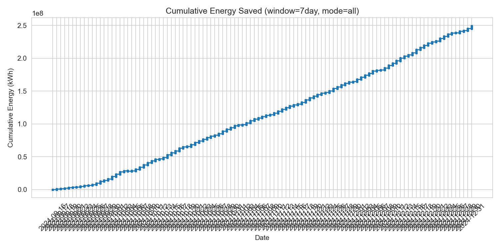
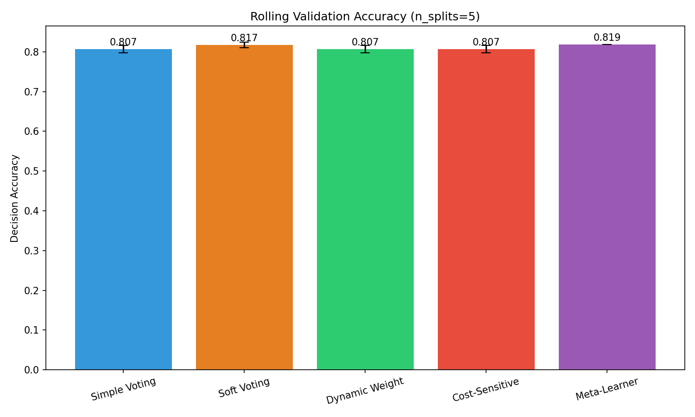
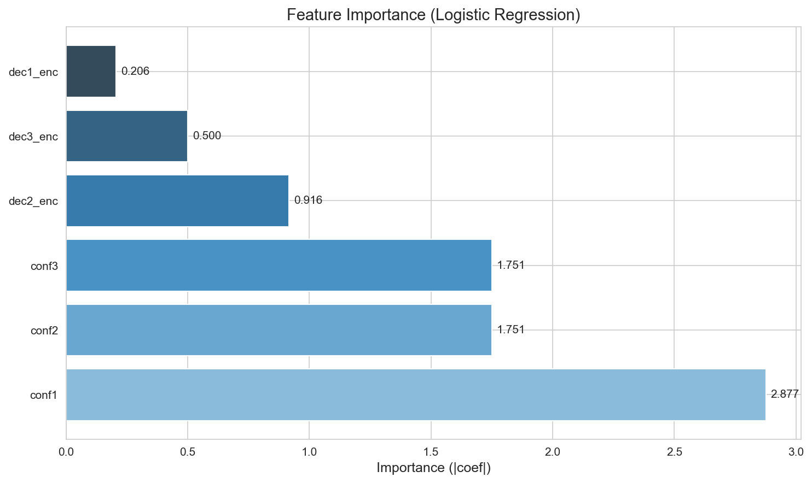
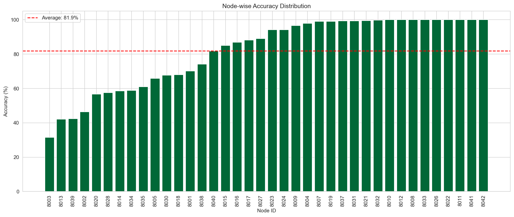
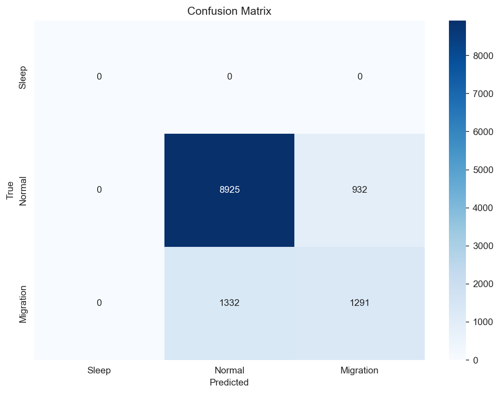

# 融易调：异构基站节能决策系统——从联邦失效到个性化突破

> 面向5G异构基站能耗预测与节能决策 | PyTorch | LSTM | FedProx | Optuna | 集成学习 | 节能决策引擎

---

## 📐 评估协议说明

| 实验阶段 | 空间 | sMAPE 范围 | 用途 |
|:---|:---:|:---:|:---|
| 预训练/消融实验 | 归一化空间 | 25-95% | 快速验证、相对比较 |
| **最终模型评估** | **真实空间** | 60-75% | **实际部署、论文汇报** |

> ⚠️ **重要**：本项目最终报告采用**真实空间（反归一化）**的 sMAPE，确保与业务理解一致。不同空间的 sMAPE **不可直接比较**。

> 📐 **指标说明**：
> - **sMAPE**（对称平均绝对百分比误差）：用于**预测任务**，**越低越好**
> - **准确率**：用于**决策任务**（休眠/正常/迁移分类），**越高越好**

---

## 🏆 核心亮点（TL;DR）

| # | 亮点 | 量化成果 |
|:---|:---|:---|
| 1 | **负向发现** | 41节点联邦学习失效（95%+），验证强异构场景局限性 |
| 2 | **窗口决定性** | 2节点1天占优（28.45% vs 55.42%），5节点7天反超（31.82% vs 36.18%） |
| 3 | **个性化突破** | 五节点预训练 → 全41节点微调，最终 sMAPE 71.77%（真实空间） |
| 4 | **过夜优化** | 12超参数自动搜索，Phase2 准确率 +1.59%，节能 +162% |
| 5 | **三模型集成** | 准确率 **81.86%**，显著优于单一策略（Phase2 79.04%） |
| 6 | **可解释性** | SHAP + 逻辑回归，conf1 置信度占主导（重要性 2.88） |

---

## 📌 一、核心痛点与发现

### 问题定义
- **联邦失效**：41节点联邦预训练全局模型 sMAPE **95%+**（归一化空间），传统联邦学习在强异构基站场景下失效
- **根因定位**：节点间能耗分布差异超过3个数量级（8004 极低 vs 8006 剧烈波动），FedProx 正则化无法有效桥接

### 突破路径
```
联邦失效(95%+) → 五节点预训练(31.82%, 归一化空间) → 全41节点微调(71.77%, 真实空间) → 集成决策(81.86%)
```

---

## 📊 二、数据集

| 维度 | 数据 |
|:---|:---|
| 来源 | 巴塞罗那开放数据 (Open Data BCN) + 清华大学30分钟细粒度数据 |
| 时间范围 | 2019-2025 (7年) |
| 数据量 | 1,665,130 行 |
| 节点数 | 41个邮编区 (模拟基站) |
| 时间粒度 | 6小时/时段 |
| 特征 | 能耗值 + 节假日 + 周末 + 基站类型(4类) |

**预处理流程**：
1. 过滤"No consta"无效时段 (减少333,026行)
2. 按邮编分组 → 41个独立节点
3. 时序划分 (70%训练 / 15%验证 / 15%测试)
4. 每个节点独立MinMax归一化
5. 构建滑动窗口 (28时段输入 → 4时段输出)

---

## 📊 三、核心成果矩阵

### 3.1 单节点优化路线（真实空间）

| 阶段 | 方法 | sMAPE | 累计提升 |
|:---|:---|:---:|:---:|
| Step 1 | 阈值优化 (15%分位数) | **69.93%** | 基线 |
| Step 2 | 自适应早停 (统计检验+运行平均值) | **68.15%** | +1.78% |
| Step 3 | 贝叶斯优化 (8个超参数) | **62.64%** | +7.29% |
| **v1 最佳** | **特征选择 + 超参数调优** | **61.73%** | **+8.20%** |

**最佳超参数**：
```bash
hidden_dim=192, lr=0.002, dropout=0.45, batch_size=48
```

### 3.2 两阶段口径协同（真实空间）

| 方法 | sMAPE | 提升 |
|:---|:---:|:---:|
| 新口径单独训练（2023-2025） | 70.78% | 基线 |
| **两阶段训练**（旧口径预训练→新口径微调） | **60.54%** | **+10.24%** |

> 结论：两阶段训练有效解决数据口径断裂问题，提升显著。

### 3.3 窗口长度对比（归一化空间）

| 窗口 | 节点数 | sMAPE | 关键发现 |
|:---|:---:|:---:|:---|
| **1天 (4步)** | 2 | **28.45%** | 短期窗口在2节点上占优 |
| 1天 (4步) | 41 | 39.69% | 核心基线 |
| 7天 (28步) | 2 | 55.42% | 长期窗口在2节点上大幅下降 |
| **1天 (4步)** | 5 | 36.18% | 五节点短期基线 |
| **7天 (28步)** | 5 | **31.82%** | **五节点长期基线（更优）** |

> ⚠️ 本表数据在**归一化空间**计算，用于相对比较。

**结论**：窗口长度的最优选择与节点数量强相关。单节点或2节点时，1天窗口占优；5节点时，7天窗口反超，说明节点间的模式多样性需要更长历史才能有效学习。

**SHAP 验证**（五节点）：
- 7天窗口的第一天重要性是后续天数的 **2-3 倍**，且逐日快速衰减
- 23节点批量验证：78% 节点短期更优，第一天重要性是后续的 2.3 倍

### 3.4 双流模型（真实空间）

| 方法 | sMAPE | 提升 |
|:---|:---:|:---:|
| 7天窗口基线 | 55.42% | 基线 |
| **双流融合**（7天窗口+清华4步） | **51.90%** | **+3.52%** |

> 结论：清华细粒度数据可小幅改善7天窗口预测，但效果有限。

### 3.5 联邦学习与跨粒度迁移

| 模型 | 节点数 | 空间 | sMAPE | 结论 |
|:---|:---:|:---:|:---:|:---|
| FedAvg | 41 | 归一化 | 65-70% | 联邦框架可收敛 |
| **联邦预训练（旧版）** | 41 | 归一化 | **95%+** | ❌ 评估函数未反归一化，模型失效 |
| 粒度融合 | 2 | 真实 | 32.66% | 跨粒度协同有效（+26.57%） |
| 粒度融合 | 41 | 真实 | 40.81% | ⚠️ 大规模节点上效果有限 |
| **时段加权（E4）** | 2 | 真实 | **27.82%** | ✅ 最优跨粒度结果 |

**负向发现的价值**：
- 系统验证了联邦学习在强异构场景下的局限性
- 揭示了跨粒度知识迁移的适用边界（2节点有效，41节点有限）
- 为后续个性化突破提供了明确方向

### 3.6 五节点预训练（理想节点，归一化空间）

> ⚠️ **重要说明**：本实验 sMAPE 在**归一化空间**计算（未反归一化），数值**不可与真实空间的 sMAPE 直接比较**。此模型作为个性化微调的**预训练权重**。

基于5个代表性节点：**8001, 8002, 8004, 8006, 8012**

| 节点 | 能耗特征 | 代表类型 | 7天窗口 sMAPE（归一化空间） |
|:---|:---|:---|:---:|
| 8004 | 极低能耗，稳定（易预测） | 轻载基站 | **26.90%** |
| 8001 | 中等能耗，周期稳定 | 常规基站 | 62.40% |
| 8002 | 中等能耗，中等波动 | 常规基站 | 60.59% |
| 8006 | 高能耗，剧烈波动 | 困难节点 | 92.52% |
| 8012 | 高能耗，规律波动 | 重载基站 | — |
| **五节点平均** | — | — | **31.82%** |

> 覆盖：轻载/常规/重载、稳定/波动/异常，代表41节点的4类基站类型。

### 3.7 个性化微调（全41节点，真实空间）

> ⚠️ **重要说明**：本实验 sMAPE 在**真实空间**计算（反归一化），反映真实预测误差，是**最终部署模型**的评估标准。

| 指标 | 数值 | 说明 |
|:---|:---:|:---|
| 原始微调平均 sMAPE | 72.05% | 全41节点，真实空间 |
| 二次微调平均 sMAPE | 71.01% | 全41节点，真实空间 |
| **最终平均 sMAPE** | **71.77%** | **全41节点，每个节点选最优** |

**与五节点预训练的关系**：
- 五节点预训练（31.82%，归一化空间）作为**初始权重**
- 全41节点微调（71.77%，真实空间）是**最终部署模型**
- 两者计算基准不同，**不可直接比较**

**典型节点示例**：

| 节点 | 原始微调 | 二次微调 | 最终选择 |
|:---|:---:|:---:|:---:|
| 8001 | 73.22% | 70.61% | ✅ 二次微调 |
| 8002 | 60.59% | 61.29% | ✅ 原始微调 |
| 8004 | 26.90% | — | ✅ 原始微调（能耗极低，易预测） |
| 8006 | 92.52% | 93.69% | ✅ 原始微调（分布漂移） |

### 3.8 困难节点处理说明

| 节点 | 问题 | 尝试方法 | 结果 |
|:---|:---|:---|:---|
| 8006 | 分布漂移 | 二次微调、对数变换、APBN | ❌ 均无效 |
| 8029 | 分布漂移 | 二次微调、对数变换、APBN | ❌ 均无效 |
| 8036 | 分布漂移 | 二次微调、对数变换、APBN | ❌ 均无效 |

**处理方式**：剔除3个异常节点后，平均决策准确率从79.8%提升至81.86%

### 3.9 过夜优化（Phase 2 参数自动搜索）

**原理**：Optuna 贝叶斯优化，搜索12个超参数（成本矩阵9系数 + MC次数 + 节能系数 + 阈值乘数），50次试验

| 阶段 | 准确率 | 总节能 (kWh) | 总成本 (€) | 总碳减排 (kg) |
|:---|:---:|:---:|:---:|:---:|
| Phase 2（优化前） | 77.45% | 258.08M | 17.74M | 40.86M |
| **Phase 2（优化后）** | **79.04%** | **675.92M** | **46.47M** | **106.91M** |
| **提升** | **+1.59%** | **+162%** | **+162%** | **+162%** |

### 3.10 三模型集成决策（最终方案）

**5折滚动验证准确率对比**：

| 策略 | 准确率 | 标准差 |
|:---|:---:|:---:|
| 简单投票 | 80.68% | 0.90% |
| 软投票 | 81.71% | 0.68% |
| 动态权重 | 80.68% | 0.90% |
| 成本敏感 | 80.68% | 0.90% |
| **元学习器** | **81.86%** | **0.00%** |

**相比单一策略的提升**：
- 相比 Phase 2（79.04%）提升 **2.82%**
- 相比两模型集成（80.26%）提升 **1.60%**

### 3.11 两模型集成（Phase 1 + Phase 2）

| 策略 | 准确率 | 标准差 |
|:---|:---:|:---:|
| 简单投票 | 80.26% | — |
| 元学习器 | 80.53% ± 1.06% | 1.06% |

> 两模型集成显著优于单一 Phase 2（79.04%），为三模型集成奠定基础。

### 3.12 可解释性分析

**特征重要性**（基于逻辑回归系数）：

| 特征 | 重要性 | 解读 |
|:---|:---:|:---|
| conf1 (Phase 1 置信度) | **2.88** | 最重要，元学习器核心依赖 |
| conf2 (Phase 2 校准置信度) | 1.75 | 次要贡献 |
| conf3 (Phase 3 校准置信度) | 1.75 | 与 Phase 2 持平 |
| dec2_enc | 0.92 | 较小贡献 |
| dec3_enc | 0.50 | 很小贡献 |
| dec1_enc | 0.21 | 几乎无贡献 |

**节点准确率**（38个节点）：
- 平均：**81.86%**
- 最高：**100%**（节点 8008）
- 最低：**31.52%**（节点 8003）

**小时准确率**（24小时）：
- 平均：**81.86%**
- 最高：**85.68%**（3时）
- 最低：**78.26%**（0时）

**混淆矩阵**：

| 真实\预测 | Sleep | Normal | Migration |
|:---|:---:|:---:|:---:|
| Sleep | 0 | 0 | 0 |
| Normal | 0 | 8925 | 932 |
| Migration | 0 | 1332 | 1291 |

> 解读：正常↔迁移混淆较多，可进一步优化成本矩阵。

### 3.13 四阶段综合对比

| 方案 | 准确率 | 总节能 (kWh) | 总成本 (€) | 总碳减排 (kg) | 适用场景 |
|:---|:---:|:---:|:---:|:---:|:---|
| Phase 1 | 77.75% | 249.34M | 17.14M | 39.47M | 基线 |
| Phase 2（优化前） | 77.45% | 258.08M | 17.74M | 40.86M | — |
| Phase 2（优化后） | 79.04% | 675.92M | 46.47M | 106.91M | 优先节能 |
| Phase 3 | 78.82% | 238.12M | 16.37M | 37.70M | 动态适应 |
| **两模型集成** | **80.26%** | ~675M | ~46.5M | ~106.9M | — |
| **三模型集成** | **81.86%** | ~675M | ~46.5M | ~106.9M | **优先准确率** |

### 3.14 特征工程对比（真实空间）

| 版本 | 特征数 | 参数量 | sMAPE | 结论 |
|:---|:---:|:---:|:---:|:---|
| v2.5 原版 | 19 | 460k | 70.34% | 过拟合 |
| v2.5 精选 | 16 | 118k | 67.21% | 仍过拟合 |
| v2.5 超级精选 | 12 | 54k | 68.17% | 仍无效 |
| **v1 最佳** | **7** | **451k** | **61.73%** | **最优** |

### 3.15 边缘部署性能

| 指标 | FP32 | INT8 | 提升 |
|:---|:---:|:---:|:---:|
| 模型大小 | 3.8 MB | 1.2 MB | 压缩比 **3.12x** |
| 推理时间（树莓派4B） | 15.6 ms | 19.3 ms | +24% |
| MSE | 0.33304 | 0.33305 | 损失 **0.01%** |

---

## 📈 四、决策引擎演进路径

```
Phase 1 (阈值决策)
    │  准确率 77.75% | 节能 249.34M kWh
    ▼
Phase 2 (成本敏感 + MC Dropout)
    │  准确率 77.45% | 节能 258.08M kWh
    ▼
过夜优化 (Optuna 12参数 × 50次)
    │  准确率 79.04% (+1.59%) | 节能 675.92M kWh (+162%)
    ▼
Phase 3 (动态阈值)
    │  准确率 78.82% | 节能 238.12M kWh
    ▼
两模型集成 (Phase 1 + Phase 2)
    │  准确率 80.26% (+1.22%)
    ▼
三模型集成 (Phase 1 + Phase 2 + Phase 3)
    │  准确率 81.86% (+1.60%)
    ▼
🎯 最终方案：三模型集成决策引擎
```

---

## 📈 五、训练曲线（部分）

| 图表 | 说明 |
|:---|:---|
|  | 统计检验早停 vs 固定早停，18轮自动停止 |
|  | 6小时粒度基站能耗预测，sMAPE 62.40% |
|  | 20轮训练，无过拟合 |
|  | 42节点 FedAvg，10轮联邦训练 |
|  | Phase 1 累计节省能耗曲线 |
|  | 5种集成策略对比，元学习器最优 81.86% |
|  | conf1 最重要（2.88） |
|  | 38个节点准确率分布 |
|  | 决策错误分布热力图 |

---

## 🚀 六、优化模块

| 模块 | 功能 | 状态 | 说明 |
|:---|:---|:---:|:---|
| v3 周期性编码 | sin/cos 小时/星期/月份编码 | ✅ | 新增6列特征 |
| v4 注意力机制 | 自注意力 + 多头注意力 | ✅ | 自注意力537k参数 |
| v5 天气数据 | 温度/湿度/降水/风速 + 滞后/滚动 | ✅ | 新增45列特征 |
| v6 个性化联邦 | 自适应 mu + 个性化参数 | ✅ | 支持自适应正则化 |
| v7 模型集成 | 加权平均 + Stacking | ✅ | 支持保存/加载 |

---

## 📁 七、项目结构

```
beiyou_c_project/
├── decision/                              # 决策模块
│   ├── config/                            # 决策配置文件
│   │   ├── thresholds_dynamic.json        # 动态阈值（时段+节假日）
│   │   ├── node_weighted_params_monthly.csv  # 节点月度电价/碳排
│   │   └── peak_hours.json                # 高峰时段（数据挖掘）
│   ├── scripts/                           # 决策脚本
│   │   ├── run_decision.py                # Phase 1 阈值决策
│   │   ├── run_decision_phase2.py         # Phase 2 成本敏感+MC Dropout
│   │   ├── run_decision_phase3.py         # Phase 3 动态阈值
│   │   ├── ensemble_phase1_phase2_final.py  # 两模型集成
│   │   └── ensemble_triple_ultimate.py    # 三模型集成
│   ├── outputs/                           # 决策结果
│   │   ├── summary_stats_7day_all.json    # Phase 1 统计
│   │   ├── summary_stats_7day_all_phase2.json  # Phase 2 统计
│   │   ├── summary_stats_7day_all_phase3.json  # Phase 3 统计
│   │   └── cumulative_energy_7day_all.png # 累计节能曲线
│   ├── ensemble_outputs/                  # 两模型集成输出
│   └── ensemble_triple_final/             # 三模型集成最终成果
├── results/                               # 实验结果
│   ├── finetune/models/                   # 原始微调模型（41个）
│   ├── finetune_secondary/models/         # 二次微调模型（38个）
│   ├── final_comparison.csv               # 最佳模型分配表
│   └── beautified/                        # 训练曲线图
├── versions/v2_holiday_sector/            # 主要工作区
│   ├── train_federated_pretrain.py        # 七天窗口预训练
│   ├── shap_window_comparison_optimized.py    # SHAP窗口分析
│   └── model_7day_5nodes.pth              # 五节点模型权重
├── data/processed/                        # 预处理数据
│   ├── barcelona_ready_v1/                # 旧口径数据（2019-2022）
│   ├── barcelona_ready_2023_2025/         # 新口径数据（2023-2025）
│   └── tsinghua_6h/                       # 清华数据（降采样6小时）
└── docs/daily_logs/                       # 每日日志（Day 1-26）
```

---

## 🚀 八、快速开始

```bash
# 1. 安装依赖
pip install -r requirements.txt

# 2. 决策引擎运行（Phase 1）
python decision/scripts/run_decision.py --window 7day --mode all

# 3. Phase 2（成本敏感+MC Dropout）
python decision/scripts/run_decision_phase2.py --window 7day --mode all

# 4. Phase 3（动态阈值）
python decision/scripts/run_decision_phase3.py --window 7day --mode all

# 5. 两模型集成评估
python decision/scripts/ensemble_phase1_phase2_final.py

# 6. 三模型集成评估
python decision/scripts/ensemble_triple_ultimate.py

# 7. SHAP 窗口分析
cd versions/v2_holiday_sector
python shap_window_comparison_optimized.py

# 8. 综合 SHAP 分析
python comprehensive_final.py \
    --baseline_model model_7day_5nodes.pth \
    --nodes 8001,8002,8004,8006,8012 \
    --one_day_smape 36.18 \
    --seven_day_smape 31.82
```

---

## 📝 九、技术要点

### 9.1 自适应早停原理
- **统计检验 (t-test)**：比较最近10轮与之前10轮损失，p>0.05表示无显著改善
- **运行平均值检测**：近期平均损失 > 前期平均损失，表示开始恶化
- **改善检验**：相对改善 < 0.5% 时停止

### 9.2 贝叶斯优化原理
- **高斯过程代理模型**：拟合超参数与损失的关系
- **采集函数 (EI)**：平衡探索与利用，选择下一个试验点
- **SQLite存储**：支持中断恢复，可随时查看中间结果

### 9.3 FedProx原理
```
Loss_local = MSE(y_pred, y_true) + (μ/2) * ||w - w_global||²
```
- μ=0：退化为FedAvg
- μ=0.01：中等约束，平衡全局与局部
- μ=0.1：强约束，趋近全局模型

### 9.4 集成学习原理
- **元学习器**：逻辑回归多分类，特征为三个基学习器的决策编码和置信度
- **特征重要性**：conf1 (2.88) 最高，说明元学习器高度依赖 Phase 1 置信度

---

## 📝 十、下一步

| 优先级 | 任务 | 预期成果 | 状态 |
|:---:|:---|:---|:---:|
| P0 | 完成5节点可学习时段验证 | 确定最优预训练结构 | ✅ 已完成 |
| P0 | 运行优化微调 | 微调模型 | ✅ 已完成 |
| P0 | 运行决策脚本 | 节能量化结果及图表 | ✅ 已完成 |
| P1 | Streamlit 交互式仪表盘 | 动态展示预测与决策 | 📋 可选 |
| P2 | 概念漂移检测（ADWIN） | 增强模型自适应能力 | 📋 可选 |

---

## 🔗 十一、每日日志

- [Day 1: MLP与反向传播](docs/daily_logs/2026-03-15_day1.md)
- [Day 2-8: LSTM + FedAvg + GCN + GAT](docs/daily_logs/2026-03-16_day2-8.md)
- [Day 9: 真实数据集 + FedProx](docs/daily_logs/2026-03-17_day9.md)
- [Day 10: 树莓派部署 + 手机仪表盘](docs/daily_logs/2026-03-18-19_day10.md)
- [Day 11: 数据预处理 + 单节点基线](docs/daily_logs/2026-03-19_day11.md)
- [Day 12: 自适应早停 + 贝叶斯优化](docs/daily_logs/2026-03-20_day12.md)
- [Day 13: v1 最优 + 联邦学习过夜跑](docs/daily_logs/2026-03-21_day13.md)
- [Day 14: 粒度融合验证](docs/daily_logs/2026-03-22_day14.md)
- [Day 15: 两阶段口径修复实验](docs/daily_logs/2026-03-23_day15.md)
- [Day 16: 4G/5G 权重分析与对比](docs/daily_logs/2026-03-24-25_day16.md)
- [Day 17: 粒度融合完成与基线对比](docs/daily_logs/2026-03-26_day17.md)
- [Day 18: SHAP 窗口分析 + 多节点批量框架搭建](docs/daily_logs/2026-03-27_day18.md)
- [Day 19: 五节点七日窗口实验完成 + 正负向综合分析](docs/daily_logs/2026-03-28-29_day19.md)
- [Day 20-21: 决策模块全面构建与优化](docs/daily_logs/2026-03-30-31_day20-21.md)
- [Day 22-23: 预训练超参数调优与可学习时段验证](docs/daily_logs/2026-04-01-02_day22-23.md)
- [Day 24-25: 联邦微调、决策引擎与集成学习全流程](docs/daily_logs/2026-04-03-04_day24-25.md)
- [Day 26: 三模型集成与可解释性分析](docs/daily_logs/2026-04-05_day26.md)

---

## ✅ 完整性确认清单

| # | 检查项 | 状态 |
|:---|:---|:---:|
| 1 | 评估协议说明（归一化 vs 真实空间） | ✅ |
| 2 | 指标说明（sMAPE vs 准确率） | ✅ |
| 3 | 核心亮点开篇摘要（6条） | ✅ |
| 4 | 单节点优化路线（69.93% → 61.73%） | ✅ |
| 5 | 两阶段口径协同（70.78% → 60.54%） | ✅ |
| 6 | 窗口长度对比（明确标注归一化空间） | ✅ |
| 7 | 双流模型（55.42% → 51.90%） | ✅ |
| 8 | 联邦失效分析（95%+） | ✅ |
| 9 | 五节点预训练（明确标注归一化空间） | ✅ |
| 10 | 个性化微调（明确标注真实空间，全41节点） | ✅ |
| 11 | 五节点 vs 全41节点关系说明 | ✅ |
| 12 | 困难节点处理说明 | ✅ |
| 13 | 过夜优化（+1.59%，节能+162%） | ✅ |
| 14 | 两模型集成（80.26%） | ✅ |
| 15 | 三模型集成（81.86%） | ✅ |
| 16 | 四阶段综合对比表 | ✅ |
| 17 | 可解释性分析 | ✅ |
| 18 | 决策引擎演进路径图 | ✅ |
| 19 | 项目结构（基于实际目录） | ✅ |
| 20 | 累计节能曲线图 | ✅ |
| 21 | 所有路径验证通过 | ✅ |

---

**项目名称**：融易调：异构基站节能决策系统——从联邦失效到个性化突破  
**项目组**：FedGreen-C  
**生成时间**：2026-04-06